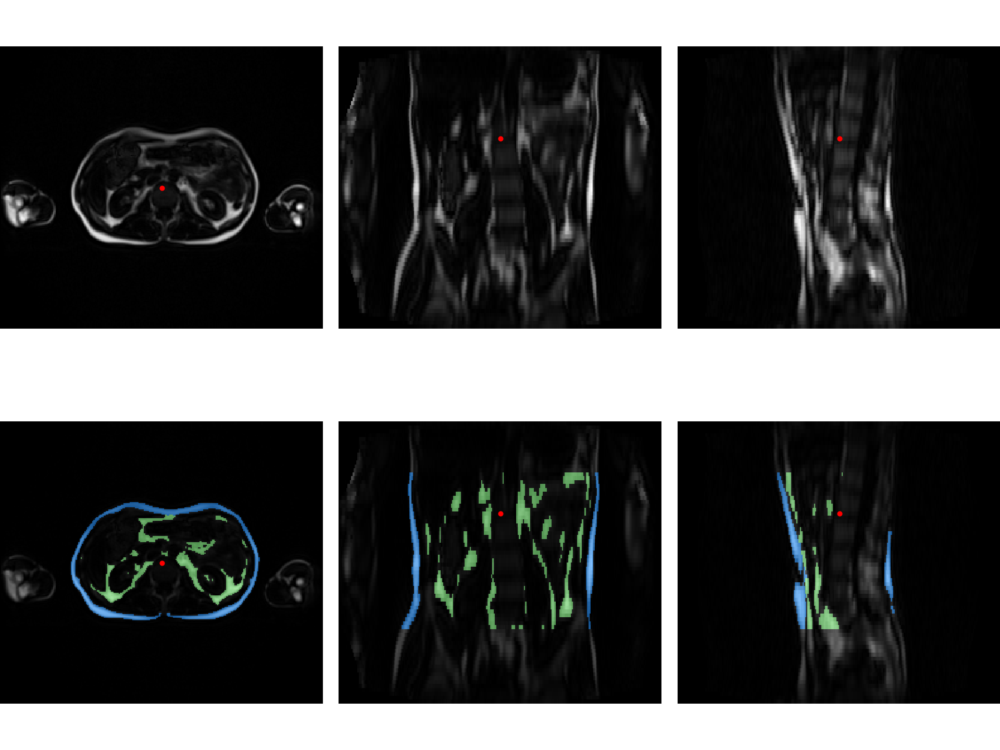

# FatSegNet : A Fully Automated Deep Learning Pipeline for Adipose Segmentation on Abdominal Dixon MRI

This repository contains the tool  designed for the [Rhineland Study](https://www.rheinland-studie.de/) 
for segmenting visceral and subcuteneous adipose tissue on fat 
images from a two-point Dixon sequence. 

If you use this tool please cite:

Estrada S, Lu R, Conjeti S, et al. 
FatSegNet: A fully automated deep learning pipeline for adipose tissue segmentation on abdominal dixon MRI.
Magn Reson Med. 2019;00:1–13. [https:// doi.org/10.1002/mrm.28022](https://onlinelibrary.wiley.com/doi/full/10.1002/mrm.28022)


## Usage

We wrap our tool on a docker image, so there is no need to install any library dependencies or drivers, 
the only requirement is to have docker (cpu) or 
nvidia-docker(gpu) installed.

Prerequisites:

* Docker (For running on CPU) (https://docs.docker.com/install/)
* NVIDIA-Docker (For running on GPU ) (https://github.com/nvidia/nvidia-docker/wiki)


## Tool installation 

 If the tool is run for the first time the FatSegNet docker image has to be created. Run the following steps
 
 1. Run on the terminal `sudo git-clone https://github.com/reuter-lab/FatSegNet.git`  or download .zip file from the github repository 
 2. From the download repository directory run on the terminal: 

* `bash build_docker_cpu.sh` for CPU (In case GPU is not available)<br/> 
* `bash build_docker_gpu.sh` for GPU <br/>

For checking that the FatSegNet image was created correctly type on the terminal<br/>
`docker images`

it should appear a repository with the name **adipose_tool** and the tag v1 for gpu or cpu_v1 for cpu.

**Example** 
``` bash
REPOSITORY        TAG       IMAGE ID      CREATED     SIZE
adipose_tool      v1        xxxxxxxx      xxxxxx      xxxx
adipose_tool      cpu_v1    xxxxxxxx      xxxxxx      xxxx    
```

**Note:** Both docker images for CPU and GPU can be created on the same machine. 

 
## Running the tool 

### **Input Data format**
For running the tool the input data is expected to be a nifti volume with size of [256,224,72], if the scans have a different size they will be crop or padd to the correct size. Additionally 
the scans have to be arrange as follows :

<!--
```  bash
#Input  Scheme                            #Output Scheme 
|-- my_dataset                           |-- my_dataset_output                                   
    participants.csv                         |-- Subject_1
    |-- Subject_1                                |-- QC
        |-- FatImaging_F.nii.gz                      |-- QC_[0-4].png (Quality control images)
        |-- FatImaging_W.nii.gz                  |-- Segmentations                                                 
    |-- Subject_2                                    |-- AAT_pred.nii.gz (Prediction Map)         
        |-- FatImaging_F.nii.gz                      |-- AAT_variables_summary.json  (Calculated Image Biomarkers)                      
        |-- FatImaging_W.nii.gz              ...............
    |-- Subject_3                            |-- Subject_xx
        |-- FatImaging_F.nii.gz                  |-- QC
        |-- FatImaging_W.nii.gz                      |-- QC_[0-4].png (Quality control images)
    ...........                                  |-- Segmentations    
    |-- Subject_xx                                   |-- AAT_pred.nii.gz (Prediction Map) 
        |-- FatImaging_F.nii.gz                      |-- AAT_variables_summary.json  (Calculated Image Biomarkers)
        |-- FatImaging_W.nii.gz
 ``` 
 -->
 ```
 #Input  Scheme                            
|-- my_dataset                                                             
    participants.csv                         
    |-- Subject_1                                
        |-- FatImaging_F.nii.gz                      
        |-- FatImaging_W.nii.gz                                                                  
    |-- Subject_2                                            
        |-- FatImaging_F.nii.gz                                         
        |-- FatImaging_W.nii.gz              
    |-- Subject_3                            
        |-- FatImaging_F.nii.gz                  
        |-- FatImaging_W.nii.gz                      
    ...........                                     
    |-- Subject_xx                                    
        |-- FatImaging_F.nii.gz                      
        |-- FatImaging_W.nii.gz
 ``` 
The fat and water scans should have the same name, the name can be defined by the user,  the default names are 
**FatImaging_F.nii.gz (Fat)** and **FatImaging_W.nii.gz(water)**.

**Participants file (participants.csv)** : the purpose of this file is to configure the participants scans 
that should be process. The file has a one compulsory column  that consist of the name of folder containing 
the water and fat scans.
 
`participants.csv` example : 

```
Subject_1
Subject_2
Subject_3
Subject_xx
```

 
### Running FatSegNet

For executing FatSegNet  is necesary to configure the docker run options and the script input arguments 
as follows :<br/>
```
#For gpu
nvidia-docker run [OPTIONS] adipose_tool:v1 [ARGUMENTS]
#For Cpu
nvidia-docker run [OPTIONS] adipose_tool:v1 [ARGUMENTS]
```

#### Options
A docker container doesnt have access to the system files so volumes has to be mounted. For our tool 
is necessary to mount  the main data directory `my_dataset` to `/tool/Data` and the desire  local output
 folder to `/tool/Output`. The output folder 
is where all pipeline output are going to be store (the input and output folder can be the same). We  
additionally recommend to use  
the following docker flags:<br/>
 * `--rm` : Automatically clean up the container and remove the file system when the container exits
 * `--user , -u `: Username or UID (format: <name|uid>[:<group|gid>])
 * `--name` : Assign a name to the container
 * `--volume , -v`: Bind mount a volume
 

**Example** 
``` bash
#For Gpu
nvidia-docker run --rm --name fatsegnet -u $(id -u) -v ../my_dataset/:/tool/Data -v ../my_dataset_output/:/tool/Output  adipose_tool:v1 [Arguments]
# For CPU
docker run -it --rm --name fatsegnet -u $(id -u) -v ../my_dataset/:/tool/Data -v ../my_dataset_output/:/tool/Output  adipose_tool:v1 [Arguments]
```

 #### Arguments
 * `--file,-f` : csv file containing the participants to process (default: participants.csv)
 * `--output_folder,-outp` : Parent folder for the scripts outputs (see output seccion) 
 * `--fat_image,-fat` : Name of the fat image (default :FatImaging_F.nii.gz)
 * `--water_image,-water`: Name of the water image (default :FatImaging_W.nii.gz)
 * `--control_images,-No_QC` : Not to plot subjects predictions for visual quality control
 * `--run_localization,-loc` : run abdominal region localization model , by default the localization model is not run
 * `--axial,-axial` : run only axial segmentation model
 * `--order,-order` : Interpolation order (0=nearest,1=linear(default),2=quadratic,3=cubic),the tool standardizes the input resolutions to [2mm,2mm,5mm]; if the axial flag is selected only the axial plane is sample.  
 * `--compartments,-comp` : Number of equal compartments to calculate the statistics (default=0.0)
 * `--increase_threshold,-AAT` : Warning flag for an increase in AAT over the define threhold between consecutive scans (default=0.4)
 * `--sat_to_vat_threshold,-ratio`: Warning flag for a vat to sat ratio higher than the define threshold (default=2.0)
 * `--runs_stats,-stats` : the AAT segmentations model are not deploy only image biomarkers are calculated,a fat scan and VAT and SAT segmentation map  is required (AAT_pred.nii.gz)
 * `--gpu_id, -gpu_id` :  GPU device ID, the container will only use the specified Gpu  (default `device ID 0`). ***Note*** the script organize the GPU IDs by pci bus IDs.
 
 
**Example**
```
# Run paper implementation 
nvidia-docker run --rm --name fatsegnet -u $(id -u) -v ../my_dataset/:/tool/Data -v ../my_dataset_output/:/tool/Output  adipose_tool:v1 -loc

# Change Participants files 
nvidia-docker run [Options]  adipose_tool:v1 -f new_participants.csv -loc

# Change name of water and fat images to search
nvidia-docker run [Options]  adipose_tool:v1  -fat fat_image.nii.gz -water water_image.nii.gz -loc

# Select a specific GPU (ex: device ID 2)
nvidia-docker run [Options]  adipose_tool:v1  -loc -gpu_id 2

# run only the segmentation models on the axial plane and define interpolation order
nvidia-docker run [Options]  adipose_tool:v1  -axial -order


```

### **Output Data format**
```  bash
#Output Scheme 
|-- my_dataset_output                                   
    |-- Subject_1
        |-- MRI (Only created if the images are resize or sample)
           |-- FatImaging_F.nii.gz (Fat_Scans)
           |-- FatImaging_W.nii.gz (Water_Scans)
        |-- QC
           |-- QC_[0-3].png (Quality control images)
        |-- Segmentations                                                 
           |-- AAT_pred.nii.gz (Only adipose tissues prediction map)
           |-- ALL_pred.nii.gz (adipose tissues and auxilary classes predictions maps)         
           |-- AAT_variables_summary.json  (Calculated Image Biomarkers) 
    |-- Subject_2
        |-- MRI (Only created if the images are resize or sample)
           |-- FatImaging_F.nii.gz (Fat_Scans)
           |-- FatImaging_W.nii.gz (Water_Scans)
        |-- QC
           |-- QC_[0-3].png (Quality control images)
        |-- Segmentations                                                 
           |-- AAT_pred.nii.gz (Only adipose tissues prediction map)
           |-- ALL_pred.nii.gz (adipose tissues and auxilary classes predictions maps)          
           |-- AAT_variables_summary.json  (Calculated Image Biomarkers)                      
    ...............
    |-- Subject_xx
        |-- MRI (Only created if the images are resize or sample)
           |-- FatImaging_F.nii.gz (Fat_Scans)
           |-- FatImaging_W.nii.gz (Water_Scans)
        |-- QC
           |-- QC_[0-3].png (Quality control images)
        |-- Segmentations    
           |-- AAT_pred.nii.gz (Only adipose tissues prediction map)
           |-- ALL_pred.nii.gz (adipose tissues and auxilary classes predictions maps)    
           |-- AAT_variables_summary.json  (Calculated Image Biomarkers)

 ``` 

**Image Biomarkers**

For more information on the pipeline image biomarkers reported in the `AAT_variables_summary.json ` file 
please check the document [FatSegNet_Variables.pdf](./FatSegNet_Variables.pdf)

**Quality Control Image Example**

By default the tool creates 4 images for visually control of the input scan and predicted segmentation, as the one shown below.
Top row fat images from axial, coronal ,sagittal view centered on the red dot; bottom row predicted segmentations 
(blue: SAT, green : VAT).    




--------
For any questions and feedback, feel free to contact santiago.estrada(at).dzne.de<br/>

--------


